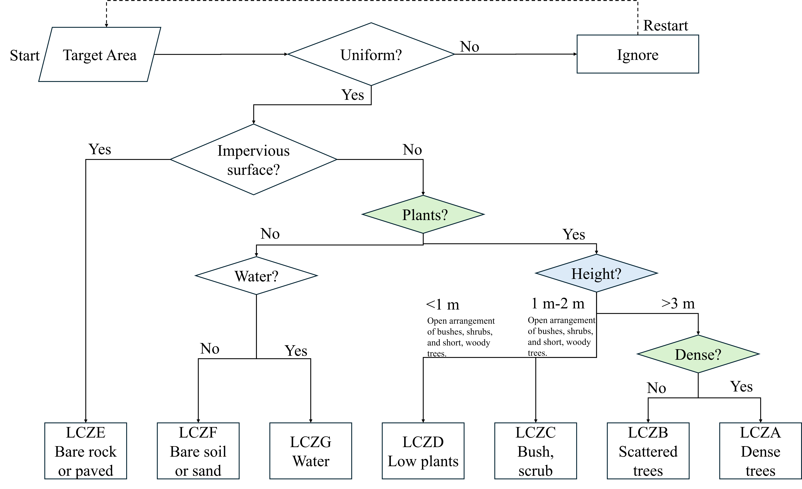

# SFMT-UDA

This repository hosts the code for the SFMT-UDA model which is a novel two-stage Source-free Multi-target Unsupervised Domain Adaptation framework for cross-city LCZ classification. 

## Usage

### Install
- python 3.9
- pytorch 2.3.1+cu121   
- torchvision 0.18.1 
- others:opencv-python, tqdm, scipy, sklearn, matplotlib, seaborn

### Train and test
- Prepare dataset
  - Download [VHRLCZ](https://drive.google.com/file/d/1Mdd2cThAvi7U_L7NUrFJyq-lTpO8Dij8/view?usp=sharing)
  - Samples in VHRLCZ are organized in the ImageNet format (The data is stored in a root directory, with each category having a separate folder). We first generate some .txt files containing paths and labels using /SFMTDA/Stage1/Generate_list/readfile_LCZ.py.
    1. Replace the folder path in `readfile_LCZ.py` with the path where you placed the dataset.
    2. then run the script: 
    ```Bash
    python readfile_LCZ.py
    ```
    3. Copy the generated .txt files to `/SFMTDA/Stage1/code/data/{dataset_name}`.

- For Stage 1
  1. Change the current directory to `SFMTDA/Stage1/code/uda`.
  2. Run the main script using:

    ```Bash
    sh run.sh
    ```

- For Stage 2, 
  - Prepare pseudo labels for Stage 2
    1. Copy `./ckps/target/uda/{dataset_name}` to the `/SFMTDA/Stage2/STDA_weights/STDA` folder
    2. Change the current directory to `/SFMTDA/Stage2`
    3. Run the script:  
    ```Bash
    sh ./brige.sh
    ```   
    4. The generated `.csv` is in `./csv_pseudo_labels`

  - Run the main script using: 
    ```Bash
    sh ./MH_MTDA.sh
    ```

- LCZ Mapping
  - Run the script:
    ```Bash
    sh ./mapping.sh
    ```

## VHRLCZ DATASET

The VHRLCZ dataset consists of two components: Jilin-1 satellite imagery and Google Earth imagery. It is primarily designed for fine-grained LCZ classification and cross-city domain adaptation research. The dataset can be accessed via [Google Drive files](https://drive.google.com/file/d/1Mdd2cThAvi7U_L7NUrFJyq-lTpO8Dij8/view?usp=sharing).  

1. Google Earth Imagery: The Google Earth imagery in VHRLCZ is sourced from the LCZC-GES2 dataset (refer to [our previous work](https://ieeexplore.ieee.org/abstract/document/10556641)). We selected Google Earth RGB images from LCZC-GES2 that cover seven cities in southeastern China: Guangzhou, Hefei, Hong Kong, Nanchang, Nanjing, Shanghai, and Wuhan. In total, there are 18,936 image patches, each measuring 320 × 320 pixels with a spatial resolution of 1 meter.  

2. Jilin-1 Imagery: We acquired Jilin-1 scene-framed products from Chang Guang Satellite Technology Co., Ltd. These images have a spatial resolution of 0.5 meters and cover areas in two Chinese cities: Guangzhou and Changsha. The imagery was manually labeled using digital polygons, following the detailed decision-rule workflow proposed by [Kim et al. (2021)](https://www.sciencedirect.com/science/article/pii/S0924271621002537) and our newly developed workflow.  

   Our workflow is:  
     

   Based on these labels, we extracted 5,667 RGB image patches, each measuring 640 × 640 pixels.


## Latest Updates 

- [2025/03/07]: Uploaded a batch of code, including the implementation of SFMT-UDA and some pretrain models. 

## Citation

If you use this code in your research, please consider citing the following paper:

```
under review 
```

## Acknowledgments  
This project is inspired by and builds upon the work from:  

- [SHOT-plus](https://github.com/tim-learn/SHOT-plus) 
- [CoNMix](https://github.com/vcl-iisc/CoNMix)  

We sincerely appreciate their contributions to this research area.

## Contact

For any inquiries or further information, please contact me.

## Other Works
There are some other works in our group:

[SSRS](https://github.com/sstary/SSRS)

